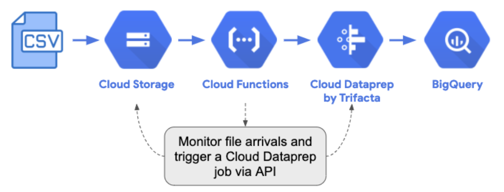

# demo-trigger-dataprep-job-from-gcs

Resources for the blog post **"How to Automate a Cloud Dataprep Pipeline on File’s Arrival"(https://xxxxxxxxx)**

- **[flow_dataprep_demo.zip](https://github.com/victorcouste/demo-trigger-dataprep-job-from-gcs/blob/master/flow_dataprep_demo.zip)** : Dataprep Flow package example to import from Dataprep UI.

- **[Customers.csv](https://github.com/victorcouste/demo-trigger-dataprep-job-from-gcs/blob/master/Customers.csv)** : Customers CSV file used as one of inputs of the flow example and to be stored in the Google Cloud Storage you want to monitor.

- **[Occupation Mapping Google Sheet](https://docs.google.com/spreadsheets/d/10EvnxBM1jXcJj62K7ovAdcA3I8JMOWGU8XUty4bU_C4/edit#gid=0)** : Google Sheet used as one of inputs of the flow example for the lookup with the Customers csv dataset.

- **[cloud-function.py](https://github.com/victorcouste/demo-trigger-dataprep-job-from-gcs/blob/master/cloud-function.py)** : Background Python function to trigger a Dataprep job when a file is created in a Google Cloud Storage bucket folder. Dataprep job started with REST API call and new file as parameter.

